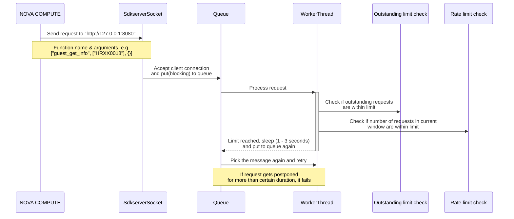

# Rate Limit In Z/VM SDKSERVER
- [Rate Limit In Z/VM SDKSERVER](#rate-limit-in-zvm-sdkserver)
  - [Context](#context)
    - [Objective](#objective)
    - [Background](#background)
  - [Design](#design)
    - [Overview](#overview)
    - [Interfaces](#interfaces)
    - [Implmentation Details](#implmentation-details)
      - [Sequence diagram](#sequence-diagram)
      - [How oustanding requests limit is checked ?](#how-oustanding-requests-limit-is-checked-)
      - [How rate limit is checked ?](#how-rate-limit-is-checked-)
      - [What happens when limit is reached ?](#what-happens-when-limit-is-reached-)
      - [Can a request by postponed indefinitely ?](#can-a-request-by-postponed-indefinitely-)
      - [Configuration parameters introduced](#configuration-parameters-introduced)
    - [Technical Debt](#technical-debt)

## Context
### Objective
The objective of this change is to enable rate-limiting capabilities in the z/vm sdkserver. This is needed so that rate at which SMAPI requests are made can be controlled, thereby avoiding any issue in SMAPI due to unprocessable amount of requests.

### Background
Recently coredump of SMAPI/SMCLI were observed in one of the customer's deployment of ICIC. The issue was triggered because of unprecedented number of requests sent to SMAPI in a very short time, i.e. almost simultaneously. This caused the SMAPI server process to crash. After discussions, few approaches/solutions were considered, for example:

1. Apply rate limit and outstanding limit on the requests sent to SMAPI by sdkserver
2. Use event notifications to get the VM state info etc. instead of using periodic polling
3. Enance the SMAPI to accept payload with multiple VM IDs instead of separate request for each VM

This document is for applying rate limit.

## Design
### Overview
The implementation of rate limit filter and max outstanding requests filter is applied to sdkserver. New configuration parameters are added to control the introduced behavior.

### Interfaces
This involves the communication between hypervisor module of nova-compute service and (z/vm) sdkserver. This is applicable to Z/VM compute nodes only. The sdkserver listens for requests from z/vm driver on 8080 (configurable) port over TCP stream.

### Implmentation Details

#### Sequence diagram

Few notes:

* The `sdkserver` opens a server socket and waits for requests from z/vm driver
* The queue is used to keep incoming requests before they can be picked and processed by any worker thread
* After accepting a request, client connection details is `put` to shared (among worker threads) queue. This is a blocking operation and waits if queue has no empty slot.
* After putting the client connection details in queue, worker thread is started. Maximum number of worker threads possible is controlled by `max_worker_count` configuration parameter. Number of threads already running within process is taken into account before starting new worker thread.
* Each worker thread picks (non-blocking) client connection details from the queue and tries to fulfil (hit SMAPI) the request.

#### How oustanding requests limit is checked ?

The oustanding requests refer to requests made to SMAPI on behalf of z/vm driver. The `SDKServer` maintains in-memory counters to check if this limit has passed for any of the requests received from z/vm driver. Just before hitting the `SMAPI`, this counter is incremented and after receiving the response (or failure), this counter is decremented. This an atomic counter and is thread-safe.

#### How rate limit is checked ?

The **rate** here refers to transactions (requests from z/vm driver) taking place in current time window. The window size can be defined using configuration parameter `smapi_rate_limit_window_size_seconds`. The transactions allowed in one window is defined by `smapi_rate_limit_per_window`. The `SDKServer` maintains in-memory data structures for keeping track of requests in current window span. The requests are tracked against total number of requests and also on basis of function name. The rate limit can be customized for specific functions also. For example, if the configuration parameter `smapi_rate_limit_per_window` is `total:30, guest_list:10, guest_get_info:5`, this means that in any given window span, there cannot be more than 30 requests hitting the SMAPI. And, number of `guest_list` and `guest_get_info` in these 30 requests, cannot be more than 10 and 5 respectively.

#### What happens when limit is reached ?

If limit for either outstanding requests or transactions in single time window exceeds configured value, the request is postponed and retried. For postponing, a delay of a randomly selected value between 1000 and 3000 milliseconds is added to processing of corresponding request.  After adding the delay, the request is re-queued so that it can be picked for processing by any of the worker threads.

#### Can a request by postponed indefinitely ?

No. The `smapi_request_postpone_threshold_seconds` configuration parameter determines maximum duration for which a request can be postponed. If specified duration has passed and that request is still unable to get processed, it will fail with error.

#### Configuration parameters introduced

|Parameter|Type|Default Value|Description|
|---------|----|-------------|-----------|
|smapi_rate_limit_window_size_seconds|int|1|The duration to consider for rate limit window. For example, if we want 30 requests per 5 seconds, then specify 5 as the value here. Setting this value to 0 disables the rate-limit check.|
|smapi_rate_limit_per_window|str|total:30|The configuration for limiting the rate at which functions can be invoked. The "total" count must be specified. Other function limits can be specified optionally, e.g. "smapi_rate_limit_per_window = total:30, guest_list:10, guest_get_info:5, ...". The cumulative value specified for other function keywords should be less than the "total" value. The option to specify custom limit for certain functions can be helpful in limiting functions which are more resource/time intensive. If the rate limit has been reached, the request received by client is postponed for execution. A request can be postponed for anywhere between 1 and 3 seconds.|
|smapi_max_outstanding_requests|int|10|Maximum number of requests allowed for which response is not yet received. If current oustanding requests exceeds allowed limit, the request is postponed for processing in future. Under this situation, a request can be postponed for a duration between 1 second and 3 seconds. Setting this value to 0 disables the outstanding requests check.|
|smapi_request_postpone_threshold_seconds|int|60|Maximum duration in seconds for which a request sent by client can be postponed due to rate limit or outstanding requests threshold|

### Technical Debt

Currently, there is no mechanism to distinguish between requests associated with a user triggered operation and those associated with background polling tasks. It is of significance that user operation triggered requests are given high priority and not be postponed if possible. Otherwise, the user operation would be sluggish which might not be desirable.
The difficulty faced in solving this is that as of now, there is not an easy way to distinguish function calls made in user triggered and periodic tasks operations. This will need more analysis and efforts.
