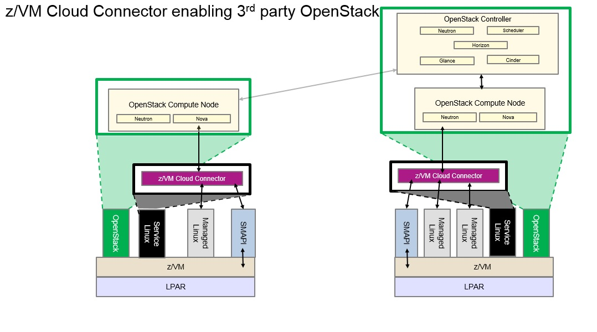
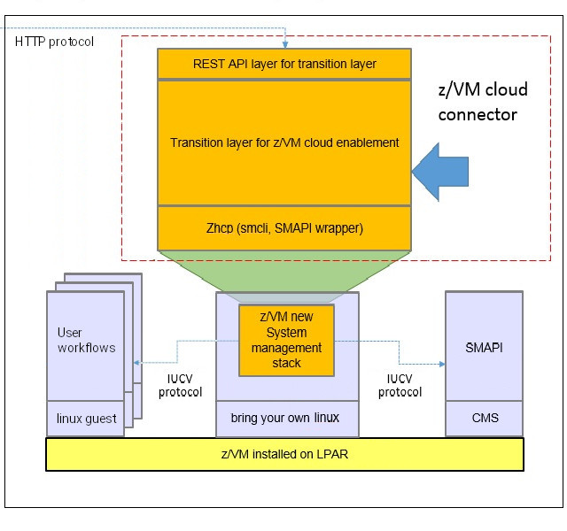

Introduction
************

What is the z/VM Cloud Connector
================================

The z/VM cloud connector is a development sdk for manage z/VM.
It provides a set of APIs to operate z/VM including guest, image,
network, volume etc.

Integration Samples
===================

* Sample 1: for openstack

Internal Architecture
=====================

Here's internal component list of zvm cloud connector.

