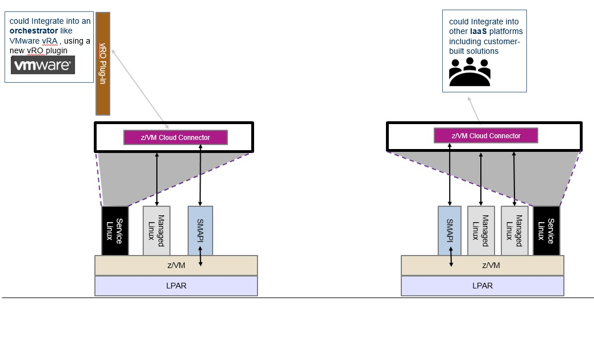
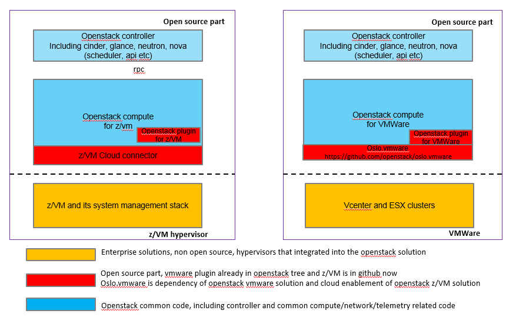

Introduction
====================

What is z/VM Cloud Connector
----------------------------

z/VM cloud connector is a development sdk for manage z/VM.
It provides a set of APIs to operate z/VM including guest, image,
network, volume etc.

Just like os-win for nova hyperv driver and oslo.vmware for
nova vmware driver, z/VM cloud connector (CloudLib4zvm) is
for nova z/vm driver and other z/VM related openstack driver such
as neutron, ceilometer.

Integration Sample
------------------

* Sample 1: for openstack

.. image:: ./images/openstack_zcc.jpg

* Sample 2: for other solutions like VMWare etc.

Internal Architecture
---------------------

Here's internal component list of zvm cloud connector.

.. image:: ./images/zcc_internal.jpg

Comparation with vmware openstack driver
----------------------------------------

Here's architecture comparsion between z/VM and vmware enablement for openstack.

