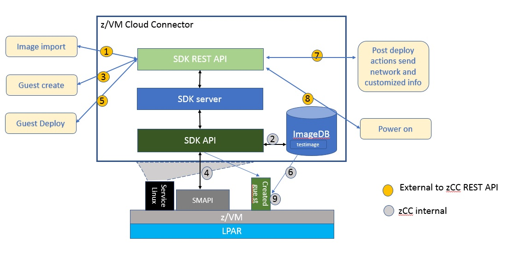
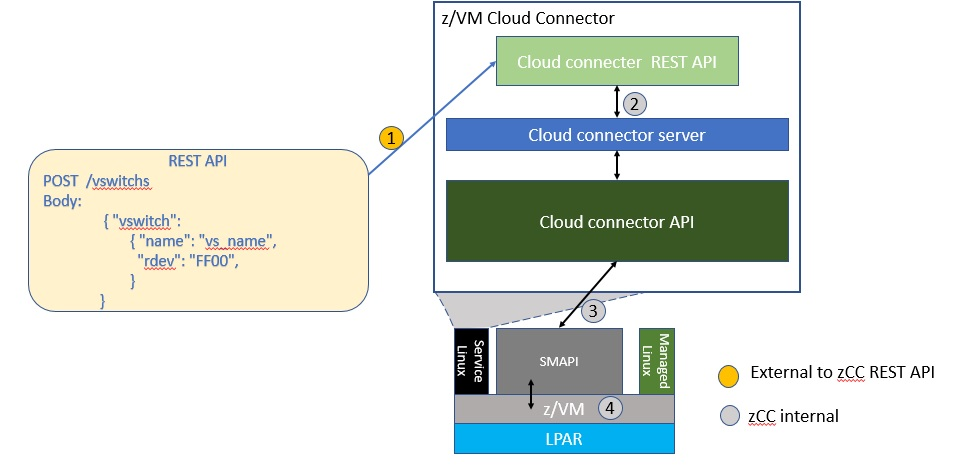

..
 Copyright Contributors to the Feilong Project.
 SPDX-License-Identifier: CC-BY-4.0

Basic Usage
***********

This section introduces the basics of using Feilong to manage z/VM host, and gives some usage examples.

Workflow description
====================

Spawning a virtual machine
--------------------------

1) Image import from external image repository into Feilong; for one image, this only needs to be done once
2) Store the information into DB record
3) Call from upper layer to create a guest
4) SMAPI calls DIRMAINT to define a user direct
5) Call from upper layer to deploy a guest
6) Feilong then starts to copy disk contents from image to the disks allocated in step 3
7) Post deploy actions such as network setup, and send customized files from Feilong to the newly deployed VM
8) Start the VM 
9) During first power on of the VM, set up the network and utilize the customized files to update network, hostname etc (by default, using cloud-init)

Creating a vswitch
------------------

1) Call from upper layer to trigger the Vswitch create call
2) HTTP service (Feilong REST API) gets the request and handles it to Feilong server
3) SMAPI is then called and handles the VSWITCH create command, this will include persistent definition of Vswitch and define it in z/VM CP
4) CP is called to create vswitch on the fly

Usage Examples
==============

The following examples show how to spawn a new VM, both in bash and in python.

Note: other language bindings exist, for example for golang.

In these examples, the Feilong connector runs at the IP address 1.2.3.4.

From the command line
---------------------

* Create a parameters file named "create-guest-id001.json":

  .. code-block:: text

      {
        "guest":
        {
          "userid": "myguest",
          "vcpus": 2,
          "memory": 2048,
          "user_profile": "osdflt",
          "disk_list": [
             {
               "size": "5g",
               "is_boot_disk": true,
               "disk_pool": "ECKD:vmpool"
            } ],
            "max_cpu": 4,
            "max_mem": "4G"
        }
      }

* Call "curl" command, referring to this parameters file:

  .. code-block:: text

      $ curl -s -X POST \
                -H "Content-Type: application/json" \
                -d @create-guest-id001.json \
                http://1.2.3.4/guests | jq

From python language
--------------------

  .. code-block:: text

      from zvmconnector import connector

      userid = 'myguest'
      vcpus = 2
      memory = 2048
      user_profile = 'osdflt'
      disk_list = [
        {
          'size': "5g",
          'is_boot_disk': True,
          'disk_pool': 'ECKD:vmpool'
        } ]
      max_cpu = 4
      max_mem = '4G'

      client = connector.ZVMConnector(
        connection_type = 'rest', ip_addr = '1.2.3.4', port = '80')

      guest_create_info = client.send_request(
        'guest_create', userid, vcpus, memory,
        disk_list = disk_list, user_profile = user_profile, max_cpu = max_cpu, max_mem = max_mem)

      if guest_create_info['overallRC']:
          raise RuntimeError('Failed to create guest: ' + guest_create_info['errmsg'])

      print('Guest created')
